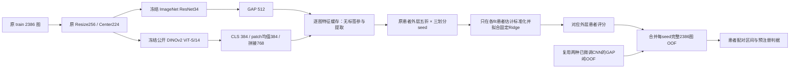

# 第九阶段流程（基线诊断，非新网络）

```mermaid
flowchart LR
    A[原 train 2386 图] --> B[原 Resize256 / Center224]
    B --> C[冻结 ImageNet ResNet34]
    B --> D[冻结公开 DINOv2 ViT-S/14]
    C --> E[GAP 512]
    D --> F[CLS 384 / patch均值384 / 拼接768]
    E --> G[逐图特征缓存：无标签参与提取]
    F --> G
    G --> H[原患者外层五折 × 三划分seed]
    H --> I[只在各fit患者估计标准化并拟合固定Ridge]
    I --> J[对应外层患者评分]
    J --> K[合并每seed完整2386图 OOF]
    L[复用两种已微调CNN的GAP岭OOF] --> K
    K --> M[患者配对区间与预注册判据]
```

内层患者不参与新头拟合或调参；既有 CNN 参考曾通过各自内层选择主干。固定 val/test 不加载，未使用 A–E 等级。四个新方案共60次解析岭拟合、零新增神经网络训练。公开预训练数据和架构不同，不能据此声称我们提出了新结构。
